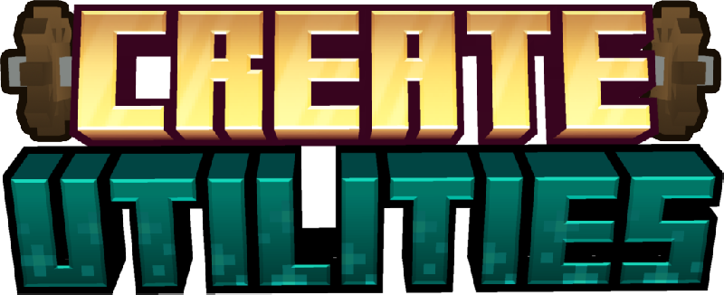

    

    
    
    

# Create Utilities
Create Utilities is a Create Addon designed to enhance your gameplay with convenient teleportation features and other useful blocks. This add-on focuses on ender-like utilities that simplify the transportation of resources and rotation over long distances.

## Download
**CurseForge**: [Create Utilities on CurseForge](https://www.curseforge.com/minecraft/mc-mods/createutilities)

**Modrinth**: [Create Utilities on Modrinth](https://modrinth.com/mod/create-utilities)

## Join our Discord server!

